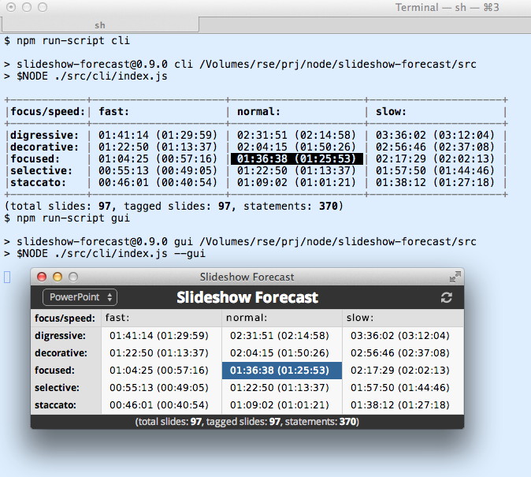

Slideshow-Forecast
==================

Slideshow Duration Forecasting

Abstract
--------

Slideshow-Forecast is a
[Node](http://nodejs.org/)/[Node-Webkit](https://github.com/rogerwang/node-webkit)/JavaScript
based Command Line Interface (CLI) and Graphical User Interface (GUI) for observing
the slideshow presentation applications supported by the [Slideshow](https://github.com/rse/slideshow) API
(mainly [Microsoft PowerPoint 2010 for Windows](http://office.microsoft.com/en-us/powerpoint/),
[Microsoft PowerPoint 2011 for Mac OS X](http://www.microsoft.com/mac/powerpoint) and
[Apple KeyNote 5 for Mac OS X](http://www.apple.com/mac/keynote/))
and displaying a forecast on the expected presentation duration. The
expected duration is based on both the number of statements the speaker
wants to give per slide (provided in the slide notes as tags in the
format `<\d\?+(\+\d+\?)*>`) and the speaker speed and speaker focus type.

Installation
------------

Use the Node Package Manager (NPM) to install this module
locally (default) or globally (with option `-g`):

    $ npm install [-g] slideshow-forecast

Usage
-----

Run the program on the Command-Line Interface (CLI) via:

    $ slideshow-forecast
      [--program powerpoint|keynote]
      [--speed fast|normal|slow]
      [--focus digressive|decorative|focused|selective|staccato]
      [--gui]

For development purposes the following short-cuts exist
for running the CLI or GUI variants:

    $ npm run-script cli
    $ npm run-script gui

License
-------

Copyright (c) 2014 Ralf S. Engelschall &lt;http://engelschall.com&gt;

This Source Code Form is subject to the terms of the Mozilla Public
License (MPL), version 2.0. If a copy of the MPL was not distributed
with this file, You can obtain one at http://mozilla.org/MPL/2.0/.

