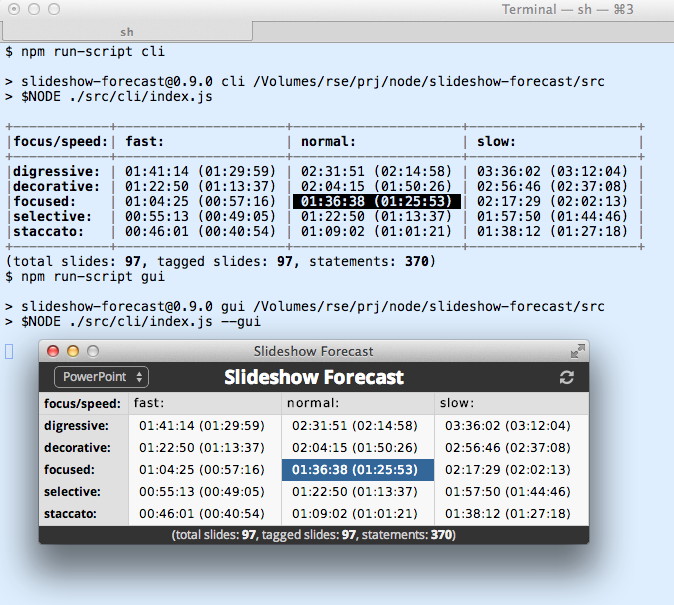
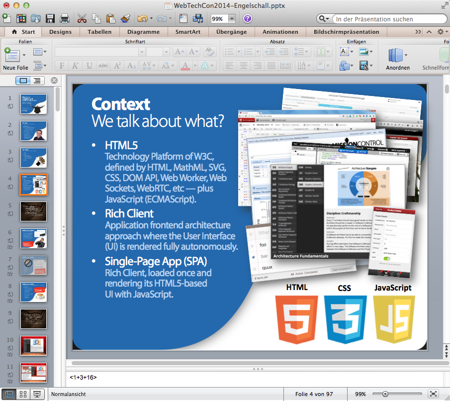

Slideshow-Forecast
==================

Slideshow Duration Forecasting

Description
-----------

Slideshow-Forecast is a
[Node](http://nodejs.org/)/[Node-Webkit](https://github.com/rogerwang/node-webkit)/JavaScript
based Command Line Interface (CLI) and Graphical User Interface (GUI) for observing
the presentation applications supported by the Node [Slideshow](https://github.com/rse/slideshow) API
(mainly [Microsoft PowerPoint 2010 for Windows](http://office.microsoft.com/en-us/powerpoint/),
[Microsoft PowerPoint 2011 for Mac OS X](http://www.microsoft.com/mac/powerpoint) and
[Apple KeyNote 5 for Mac OS X](http://www.apple.com/mac/keynote/))
and displaying a forecast on the expected presentation duration.

The expected presentation duration is based on a calculation on both the number of statements the speaker
wants to give per slide (provided by the speaker somewhere in his slide notes as textual tags in the
format `<\d\?+(\+\d+\?)*>`) and the speaker speed and speaker focus type.

This prognosis schema is modeled according to the following observations:

1. Independent how less or much content the slides contain,
   the speaker knows and can tell us how many _statements_ he intends
   to give to his audience for each individual slide. This is actually
   independent of the actual speaker and his speed and focus type (see
   below). Hence, this information is directly attached to the slides
   during presentation preparation-time.

2. A single statement is assumed (in this model) to be given with a
   single average-length sentence. The speaker has to keep this
   in mind in order decide on his number of required statements.

3. A speaker is classified by two dimensions:

   - Speaking Speed
      - `fast`:   assumed to need  6.0s for a sentence on average and assumed to pause 1.0s between sentences on average.
      - `normal`: assumed to need  9.0s for a sentence on average and assumed to pause 1.5s between sentences on average.
      - `slow`:   assumed to need 13.0s for a sentence on average and assumed to pause 2.0s between sentences on average.

   - Speaking Focus
      - `digressive`: assumed to express core plus addon information with extensive amount of sentences.
      - `decorative`: assumed to express core plus addon information with regular amount of sentences.
      - `focused`:    assumed to express core information only with regular amount of sentences.
      - `selective`:  assumed to express core information only with reduced amount of sentences.
      - `staccato`:   assumed to express core information only with absolute minimum number of sentences.

   The speaker of `staccato` focus type is assumed to require only the total number of given statements. All
   others need more, with an increasing factor towards the `digressive` focus type.

The following is a forecast in the CLI and GUI for a large 97-slide presentation:

See the slide note area for one of the tags. Here the speaker said `<1+3+16>`
because he intends to state the title, the three bullet points and give
two statements per example app.

Installation
------------

Use the Node Package Manager (NPM) to install this module
locally (default) or globally (with option `-g`):

    $ npm install [-g] slideshow-forecast

Usage
-----

First, start your presentation application and load your slideset.
Ensure that in the slide notes you provide the number of required statements.
Then run Slideshow-Forecast on the Command-Line Interface (CLI) via:

    $ slideshow-forecast
      [--program powerpoint|keynote]
      [--speed fast|normal|slow]
      [--focus digressive|decorative|focused|selective|staccato]
      [--gui]

The option `--gui` opens the Graphical User Interface (GUI) variant.

For development purposes, the following shortcuts also exist
for running the CLI or GUI variants without prior installation:

    $ npm run-script cli
    $ npm run-script gui

License
-------

Copyright (c) 2014 Ralf S. Engelschall &lt;http://engelschall.com&gt;

This Source Code Form is subject to the terms of the Mozilla Public
License (MPL), version 2.0. If a copy of the MPL was not distributed
with this file, You can obtain one at http://mozilla.org/MPL/2.0/.

